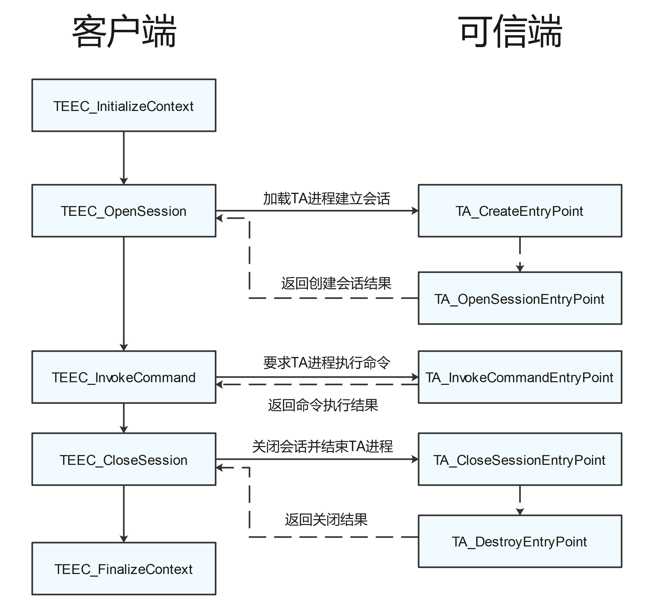

# TEE客户端应用开发概述

-   [基础概念](#section118422174214)
-   [功能简介](#section15481732202216)

本文档指导用户进行客户端应用开发，访问安全应用能力。

## 基础概念

-   REE

    富执行环境（Rich Execution Environment，REE），运行在正常模式下。

-   TEE

    可信执行环境TEE（Trusted Execution Environment，TEE），运行在安全模式下。

-   CA

    Client Application，运行在正常模式的客户端应用。

-   TA

    Trusted Application，运行在安全模式的可信应用。

## 功能简介

可信应用的设计分为客户端应用和可信端应用，GlobalPlatform API标准定义（GP规范）定义了CA和TA之间的API接口，CA和TA按照规定的接口进行通信，其典型交互模型如下图所示：

**图 1**  客户端应用和可信端应用接口交互过程  

