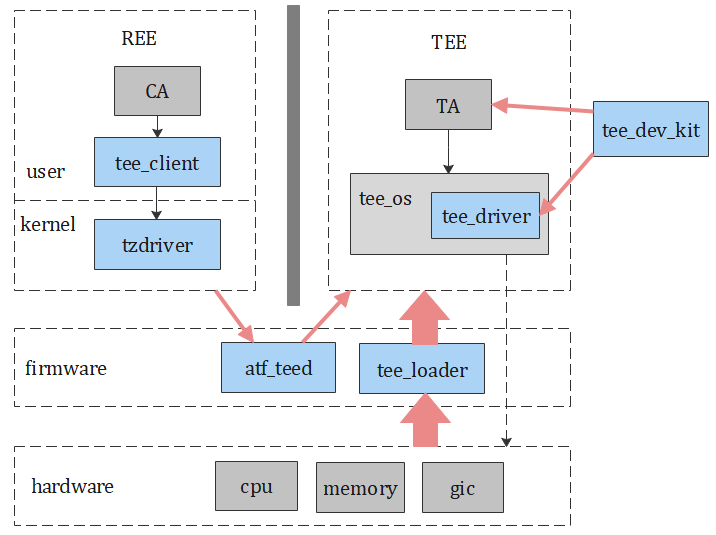

# TEE子系统概述

## 概述

本文档介绍了厂商如何使能TEE子系统。TEE子系统是一个小型的、独立运行的操作系统，需要配置必要的硬件信息才能正常运行，如物理内存地址、中断号、串口等，厂商需要在固件中适配这些硬件信息。TEE子系统提供了开发套件支持厂商独立开发硬件驱动，本文提供了驱动开发的指导。如果REE侧的应用要访问TEE，还需要经过TEE Client、Tzdriver、ATF等模块，本文档也提供了这些模块的适配方法。

## 基本概念

-   TrustZone

    ARM处理器内核的一个安全扩展，该项技术可以保护安全内存、加密块、键盘和屏幕等外设，从而可确保它们免遭软件攻击。

-   安全存储

    将用户数据存储在安全的存储介质中，从而不会被非法获取到。

-   REE

    富执行环境（Rich Execution Environment，REE），运行在正常模式下。

-   TEE

    可信执行环境TEE（Trusted Execution Environment，TEE），运行在安全模式下。

-   CA

    正常模式的客户端应用（Client Application，CA）。

-   TA

    安全模式的可信应用（Trusted Application，TA）。

-   sec

    运行于TEE中的一种可信应用或驱动的格式。

-   perm\_config

    sec文件的一部分，包含了对sec文件权限的配置。

-   ta\_cert.der

    TA证书，作为TA身份的唯一标示，打包在perm\_config中。

-   taconfig.der

    Config证书，打包在perm\_config中，所有TA共用一份。

## 运作机制

图1 TEE子系统架构图

### tee\_client

TeeClient向应用提供访问TEE的接口，让非安全侧应用可以访问TEE内运行的安全应用。

### tzdriver

Tzdriver（TrustZone driver）是内核中的一个字符设备驱动。Tzdriver初始化时会创建一个字符设备文件，一般为/dev/tc\_ns\_client。TEE Client应用必须通过tzdriver驱动访问TEE。

### atf\_teed

atf\_teed作为适配在ATF（Arm Trusted Firmware）中的模块，提供TEE与REE切换的服务。

### tee\_loader

tee\_loader用于加载TEE侧安全镜像到RAM（Random Access Memory）。

### tee\_driver

如果需要在tee中访问硬件，厂商需要自行开发驱动程序。本文档提供了驱动开发指导。

### tee\_dev\_kit

tee\_dev\_kit为开发者提供开发TA和驱动程序所需要的编译环境、API接口和接口说明文档等。

