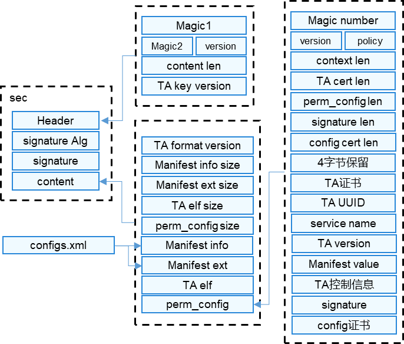
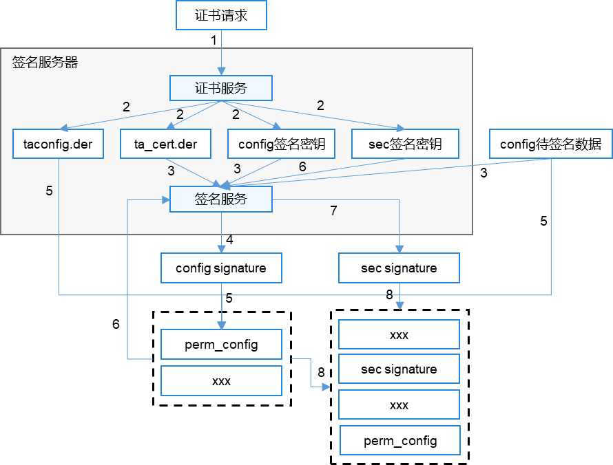

# TEE Dev Kit适配指导<a name="ZH-CN_TOPIC_0000001256814481"></a>

## 概述<a name="section15965152175313"></a>

### 功能介绍<a name="section1329511429586"></a>

本文为SDK适配指导手册，对CA\(Certification Authority\)认证体系、签名服务器适配等进行说明，用于指导厂商完成TEE SDK的适配工作。

### 基本概念<a name="section169708014598"></a>

-   TEE SDK

    SDK包提供了二进制编译能力，包含依赖的TEE OS头文件、make和cmake编译脚本以及perm\_config签名、sec签名能力，SDK的构成如下所示，厂商定制后，建议基本构成与当前基本保持一致。其中，build/pack-Config和build/signtools需适配成厂商定制方案，build/keytools替换成厂商提供的颁发证书、密钥的程序或工具。

    ```
    ├── build
    │   ├── cmake                             # cmake编译框架能力
    │   ├── config_tee_private_sample.ini     # sec签名和perm_config签名的python脚本的ini配置文件，需要厂商进行配置
    │   ├── keytools                          # 密钥、证书请求生成，证书颁发
    │   ├── mk                                # make编译框架能力
    │   ├── pack-Config                       # 提供签名打包perm_config的能力
    │   ├── pack-TA                           # 提供sec签名能力的shell脚本
    │   ├── signtools                         # 提供sec签名能力的python脚本
    │   └── tools                             # 包含sec文件链接的ld文件（32位和64位）、sec文件二进制检查的shell脚本        
    ├── CHANGELOG                             # SDK版本的变更记录
    ├── include                               # 二进制编译依赖的TEEOS头文件
    │   ├── CA                                # CA编译依赖的头文件
    │   └── TA                                # TA编译依赖的头文件
    ├── README.md                             # SDK包的英文说明文件
    ├── README_zh.md                          # SDK包的中文说明文件
    ├── src
    │   └── TA                                # TA编译依赖的ta_magic.c，32位TA包含此定义时，可以控制TA走tarunner加载器加载，否则32位TA走taloader加载器；64位TA不涉及，64位TA都走tarunner加载器
    ├── test                                  # 可信应用样例demo
    │   ├── CA
    │   └── TA
    ├── thirdparty
    │   └── open_source
    │       ├── libboundscheck                # TA编译依赖的安全函数库头文件归档路径
    │       └── musl                          # TA编译依赖的libc头文件归档路径
    └── VERSION                               # SDK包软件版本号
    ```

    > **注意：** 
    >提供的密钥、证书生成及签名功能仅可用作demo功能演示，厂商在使用时，需要进行定制适配，替换此部分功能。


-   TA

    以sec文件格式存储，TA的构成参考下图：

    

    -   CA\(Certification Authority\)：证书颁发机构，负责发放和管理数字证书的权威机构。
    -   密钥：包含非对称加密中使用的公钥和私钥，公钥和私钥对用于数字签名和验证。
    -   证书请求文件：格式为.csr，全称为Certificate Signing Request，包含密钥对中的公钥和公共名称、组织名称、组织单位等信息，用于申请数字证书。
    -   数字证书：格式为.der，由厂商适配后的签名服务器颁发。
    -   perm\_config文件：包含TA的基本信息、权限设置等内容，每个TA中都包含一个perm\_config文件。


### 约束与限制<a name="section1888318554810"></a>

-   需要厂商部署CA认证体系
-   需要厂商部署在线签名服务器

## 开发指导<a name="section146449135416"></a>

### 场景介绍<a name="section1199413505520"></a>

厂商在使用TEE后，需要向三方开发者提供SDK。厂商最终提供的SDK，需要是基于OpengHarmony社区中SDK适配后的方案。

需要适配的内容如下：

-   CA认证体系部署
-   签名服务器替换
-   密钥适配
-   配置选项适配

### 接口说明<a name="section0888123414110"></a>

厂商需要适配的SDK中的python接口如下表：

**表 1**  厂商适配接口

<a name="table2112853133519"></a>
<table><thead align="left"><tr id="row3112175363517"><th class="cellrowborder" valign="top" width="50%" id="mcps1.2.3.1.1"><p id="p711265315351"><a name="p711265315351"></a><a name="p711265315351"></a>接口名</p>
</th>
<th class="cellrowborder" valign="top" width="50%" id="mcps1.2.3.1.2"><p id="p131139531354"><a name="p131139531354"></a><a name="p131139531354"></a>描述</p>
</th>
</tr>
</thead>
<tbody><tr id="row11113155316352"><td class="cellrowborder" valign="top" width="50%" headers="mcps1.2.3.1.1 "><p id="p201131538350"><a name="p201131538350"></a><a name="p201131538350"></a>gen_config_sign</p>
</td>
<td class="cellrowborder" valign="top" width="50%" headers="mcps1.2.3.1.2 "><p id="p19113125313351"><a name="p19113125313351"></a><a name="p19113125313351"></a>对组包好的数据进行签名，得到perm_config文件的签名</p>
</td>
</tr>
<tr id="row174397610366"><td class="cellrowborder" valign="top" width="50%" headers="mcps1.2.3.1.1 "><p id="p744015614362"><a name="p744015614362"></a><a name="p744015614362"></a>gen_signature</p>
</td>
<td class="cellrowborder" valign="top" width="50%" headers="mcps1.2.3.1.2 "><p id="p044056123611"><a name="p044056123611"></a><a name="p044056123611"></a>对组包好的数据进行签名，得到sec文件的签名</p>
</td>
</tr>
</tbody>
</table>

### 开发步骤<a name="section1767617461112"></a>
1. 编译适配
    编译依赖的bounds\_checking\_function和musl头文件，分别按照/open\_source/bounds\_checking\_function和thirdparty/open\_source/musl下的README指导文档来操作即可。

2.  证书服务适配

    sec文件中使用的证书，都是通过CA颁发的。TEE SDK中使用keytools工具来完成密钥生成和证书颁发。keytools工具中使用的CA通过OpenSSL命令行生成，只能用于功能演示，因此，厂商需要自行搭建证书服务（签名服务器的一部分），实现证书颁发的功能，替换keytools工具。证书服务需要提供的能力：

    -   密钥生成
    -   证书请求生成
    -   数字证书颁发

    1.  CA认证体系部署

        厂商需要部署根CA和二级CA，具体如下所示：

        两个二级CA区分互通与不互通两个场景。

        1.  互通：互通场景下二级CA可以由OH根CA统一分配，CA公钥打包在TEE镜像头中（详见密钥适配章节），各厂商一致。使用该CA颁发的证书最终签出的sec文件，在TEE中加载时使用证书中携带的公钥进行验签，所以该场景下的sec文件可以运行在所有厂商的TEE中。
        2.  不互通：不互通场景下二级CA厂商可自己部署，CA公钥打包在TEE镜像头中（详见密钥适配章节），各厂商不同。使用该CA颁发的证书最终签出的sec文件，在TEE中加载时，sec文件验签需要使用厂商打包在TEE镜像头中的密钥（详见密钥适配章节），所以该场景下的sec文件只能运行在厂商适配的TEE中。

    2.  替换keytools工具

        厂商CA认证体系部署完成后，需要在SDK中提供证书申请、密钥生成、证书颁发的脚本或工具，具体实现方式厂商可自行确定。config证书是所有TA共用的，所以厂商需要提前生成config证书，将证书及对应的私钥保存在签名服务器上。最后删除SDK包中的keytools工具，并提供新方案的使用说明。

        在此给出几点建议：

        1.  建议厂商对不互通场景下证书的颁发进行管控，如果申请release证书，需要校验申请者是否有release TA的开发权限，如果权限校验失败，则不颁发证书。
        2.  建议厂商将不互通场景下证书颁发、perm\_config签名整合在一起，对于开发者来说，提供输入后，得到的是签名后的perm\_config二进制文件，颁发的证书和perm\_config签名的密钥不返回给开发者，这样可以控制开发者不能随意修改TA的权限。如果采取这种方案，需要将build/pack-Config中输入文件解析、数据打包的脚本集成到厂商管控的服务器中。

2.  签名服务适配

    OpenHarmony社区提供的SDK中perm\_config文件、sec文件的签名使用的是OpenSSL命令行本地签名，签名使用的密钥存放在SDK中，对开发者没有进行权限上的管控。厂商提供的签名服务器应包含证书服务与签名服务两部分，并实现密钥管理和访问权限控制。

    1.  签名服务器搭建

        厂商需要搭建签名服务器，实现方式厂商可自行决定，签名服务器需要提供的能力如下：

        -   证书服务。见步骤1签名服务适配。
        -   签名服务。步骤2需要进行适配。

    2.  签名脚本适配
        -   perm\_config签名

            将signtool\_config.py脚本中gen\_config\_sign接口适配为调用签名服务器进行签名，例如：

            ```
            def gen_config_sign(sign_conf_alg, input_path_gen, header,config, ta_cert, output_file):
                # 使用签名服务器提供的访问机制申请签名
                return
            ```

        -   sec签名

            signtool\_sec.py脚本中gen\_signature接口适配为调用签名服务器进行签名，例如：

            ```
            def gen_signature(cfg, uuid_str, raw_data, raw_data_path, hash_file_path, out_file_path, out_path, key_info_data):
                # 使用签名服务器提供的访问机制申请签名
                return
            ```

    3.  算法能力提供

        当前SDK中支持ECDSA/RSA签名算法，厂商可以根据CA部署情况对签名算法进行支持。

    4.  密钥管理

        需要保存在签名服务器中的密钥：

        -   config证书对应的私钥。config证书所有TA共用一份，对应的私钥也是所有TA共用一份，所以证书及私钥需要提前生成，放置于签名服务器上。建议不互通场景下config证书及对应的私钥不要返回给开发者。
        -   不互通场景下，release TA签名使用的私钥。这把密钥，各厂商不相同，对于同一厂商，所有的TA都使用同一把密钥签名，这把密钥不能返回给开发者，并且对于申请使用这把密钥的开发者要有权限管控，如果开发者权限校验失败，则不能签发release TA。

        互通场景及不互通场景debug TA签名使用的私钥是开发者自己申请生成的，不需要保存在签名服务器中。

    5.  签名控制
        -   需要使用在线签名服务器签名的场景如下所示，其他场景可以允许开发者在本地进行签名：
        -   不互通场景下perm\_config签名。
        -   不互通场景下，release TA签名。

    **图 2**  签名基本流程示意图<a name="fig1796118481577"></a>  
    

    替换签名服务器后，sec文件生成的基本流程：

    1.  开发者提交密钥生成和证书请求。
    2.  签名服务器中证书服务生成config签名密钥、sec签名密钥、config证书、TA证书。
    3.  开发者将解析后的数据输入签名服务器，使用签名服务进行perm\_config签名。
    4.  签名服务器将perm\_config的签名结果config signature返回给开发者。
    5.  开发者使用打包脚本打包得到perm\_config文件。
    6.  开发者将perm\_config及其他数据组包后输入签名服务器，使用签名服务进行sec文件签名。
    7.  签名服务器将sec文件签名结果sec signature返回给开发者。
    8.  开发者将数据打包得到最终的sec文件。

3.  密钥适配

    厂商需要将三把密钥通过镜像打包脚本打包到TEE镜像头中：

    -   互通场景二级CA的公钥
    -   不互通场景二级CA的公钥
    -   不互通场景下用于release TA验签的公钥

4.  配置选项适配

    config\_tee\_private\_sample.ini文件中的字段需要厂商统一进行配置，并将命名中的sample去掉，排查sdk包中使用此名字的地方进行更新。

    此文件中各配置项含义如下表所示：

    **表 2**  config\_tee\_private\_sample.ini样例配置文件字段说明

    <a name="table3315182910819"></a>
    <table><thead align="left"><tr id="row1131592920819"><th class="cellrowborder" valign="top" width="24.98%" id="mcps1.2.5.1.1"><p id="p103158291083"><a name="p103158291083"></a><a name="p103158291083"></a>字段</p>
    </th>
    <th class="cellrowborder" valign="top" width="25.019999999999996%" id="mcps1.2.5.1.2"><p id="p12315112919813"><a name="p12315112919813"></a><a name="p12315112919813"></a>取值</p>
    </th>
    <th class="cellrowborder" valign="top" width="25%" id="mcps1.2.5.1.3"><p id="p163159291087"><a name="p163159291087"></a><a name="p163159291087"></a>含义</p>
    </th>
    <th class="cellrowborder" valign="top" width="25%" id="mcps1.2.5.1.4"><p id="p1031572916817"><a name="p1031572916817"></a><a name="p1031572916817"></a>说明</p>
    </th>
    </tr>
    </thead>
    <tbody><tr id="row153151295810"><td class="cellrowborder" rowspan="3" valign="top" width="24.98%" headers="mcps1.2.5.1.1 "><p id="p031612913814"><a name="p031612913814"></a><a name="p031612913814"></a>secSignKeyLen</p>
    </td>
    <td class="cellrowborder" valign="top" width="25.019999999999996%" headers="mcps1.2.5.1.2 "><p id="p1231672911812"><a name="p1231672911812"></a><a name="p1231672911812"></a>256</p>
    </td>
    <td class="cellrowborder" valign="top" width="25%" headers="mcps1.2.5.1.3 "><p id="p1031682916818"><a name="p1031682916818"></a><a name="p1031682916818"></a>ECDSA算法密钥长度</p>
    </td>
    <td class="cellrowborder" rowspan="3" valign="top" width="25%" headers="mcps1.2.5.1.4 "><p id="p831613291389"><a name="p831613291389"></a><a name="p831613291389"></a>sec文件签名使用私钥的长度，支持ECDSA和RSA算法，算法类型及密钥长度应与签名服务器颁发的证书及密钥一致</p>
    </td>
    </tr>
    <tr id="row203161629082"><td class="cellrowborder" valign="top" headers="mcps1.2.5.1.1 "><p id="p1231614291081"><a name="p1231614291081"></a><a name="p1231614291081"></a>2048</p>
    </td>
    <td class="cellrowborder" rowspan="2" valign="top" headers="mcps1.2.5.1.2 "><p id="p9316112911815"><a name="p9316112911815"></a><a name="p9316112911815"></a>RSA算法密钥长度</p>
    </td>
    </tr>
    <tr id="row1431612291289"><td class="cellrowborder" valign="top" headers="mcps1.2.5.1.1 "><p id="p1531610290816"><a name="p1531610290816"></a><a name="p1531610290816"></a>4096</p>
    </td>
    </tr>
    <tr id="row13161129783"><td class="cellrowborder" rowspan="2" valign="top" width="24.98%" headers="mcps1.2.5.1.1 "><p id="p1331672915817"><a name="p1331672915817"></a><a name="p1331672915817"></a>secHashType</p>
    </td>
    <td class="cellrowborder" valign="top" width="25.019999999999996%" headers="mcps1.2.5.1.2 "><p id="p14316929783"><a name="p14316929783"></a><a name="p14316929783"></a>0</p>
    </td>
    <td class="cellrowborder" valign="top" width="25%" headers="mcps1.2.5.1.3 "><p id="p63164292816"><a name="p63164292816"></a><a name="p63164292816"></a>SHA256</p>
    </td>
    <td class="cellrowborder" rowspan="2" valign="top" width="25%" headers="mcps1.2.5.1.4 "><p id="p73166297819"><a name="p73166297819"></a><a name="p73166297819"></a>sec文件签名使用算法对应的哈希算法类型</p>
    </td>
    </tr>
    <tr id="row531662917815"><td class="cellrowborder" valign="top" headers="mcps1.2.5.1.1 "><p id="p14316129681"><a name="p14316129681"></a><a name="p14316129681"></a>1</p>
    </td>
    <td class="cellrowborder" valign="top" headers="mcps1.2.5.1.2 "><p id="p531682918812"><a name="p531682918812"></a><a name="p531682918812"></a>SHA512</p>
    </td>
    </tr>
    <tr id="row5316172914815"><td class="cellrowborder" rowspan="2" valign="top" width="24.98%" headers="mcps1.2.5.1.1 "><p id="p16316102920818"><a name="p16316102920818"></a><a name="p16316102920818"></a>secPaddingType</p>
    </td>
    <td class="cellrowborder" valign="top" width="25.019999999999996%" headers="mcps1.2.5.1.2 "><p id="p1231617291286"><a name="p1231617291286"></a><a name="p1231617291286"></a>0</p>
    </td>
    <td class="cellrowborder" valign="top" width="25%" headers="mcps1.2.5.1.3 "><p id="p1531612291989"><a name="p1531612291989"></a><a name="p1531612291989"></a>PKCS1</p>
    </td>
    <td class="cellrowborder" rowspan="2" valign="top" width="25%" headers="mcps1.2.5.1.4 "><p id="p10316112915818"><a name="p10316112915818"></a><a name="p10316112915818"></a>sec文件签名RSA算法使用的填充类型，对ECDSA算法无效</p>
    </td>
    </tr>
    <tr id="row1631614291686"><td class="cellrowborder" valign="top" headers="mcps1.2.5.1.1 "><p id="p7316102920820"><a name="p7316102920820"></a><a name="p7316102920820"></a>1</p>
    </td>
    <td class="cellrowborder" valign="top" headers="mcps1.2.5.1.2 "><p id="p193161829781"><a name="p193161829781"></a><a name="p193161829781"></a>PSS</p>
    </td>
    </tr>
    <tr id="row131616296812"><td class="cellrowborder" rowspan="2" valign="top" width="24.98%" headers="mcps1.2.5.1.1 "><p id="p631610295811"><a name="p631610295811"></a><a name="p631610295811"></a>secSignAlg</p>
    </td>
    <td class="cellrowborder" valign="top" width="25.019999999999996%" headers="mcps1.2.5.1.2 "><p id="p183167298812"><a name="p183167298812"></a><a name="p183167298812"></a>RSA</p>
    </td>
    <td class="cellrowborder" valign="top" width="25%" headers="mcps1.2.5.1.3 "><p id="p43162291788"><a name="p43162291788"></a><a name="p43162291788"></a>RSA算法</p>
    </td>
    <td class="cellrowborder" rowspan="2" valign="top" width="25%" headers="mcps1.2.5.1.4 "><p id="p031711294815"><a name="p031711294815"></a><a name="p031711294815"></a>sec文件签名使用的算法类型，算法类型应与签名服务器颁发的证书一致</p>
    </td>
    </tr>
    <tr id="row113177295810"><td class="cellrowborder" valign="top" headers="mcps1.2.5.1.1 "><p id="p431720295813"><a name="p431720295813"></a><a name="p431720295813"></a>ECDSA</p>
    </td>
    <td class="cellrowborder" valign="top" headers="mcps1.2.5.1.2 "><p id="p17317122916811"><a name="p17317122916811"></a><a name="p17317122916811"></a>ECDSA算法</p>
    </td>
    </tr>
    <tr id="row1931710291984"><td class="cellrowborder" valign="top" width="24.98%" headers="mcps1.2.5.1.1 "><p id="p1331719291812"><a name="p1331719291812"></a><a name="p1331719291812"></a>configVersion</p>
    </td>
    <td class="cellrowborder" valign="top" width="25.019999999999996%" headers="mcps1.2.5.1.2 "><p id="p73170294812"><a name="p73170294812"></a><a name="p73170294812"></a>0</p>
    </td>
    <td class="cellrowborder" valign="top" width="25%" headers="mcps1.2.5.1.3 "><p id="p13317929882"><a name="p13317929882"></a><a name="p13317929882"></a>固定值</p>
    </td>
    <td class="cellrowborder" valign="top" width="25%" headers="mcps1.2.5.1.4 "><p id="p731715291585"><a name="p731715291585"></a><a name="p731715291585"></a>perm_config中包含config证书</p>
    </td>
    </tr>
    <tr id="row14317129181"><td class="cellrowborder" rowspan="3" valign="top" width="24.98%" headers="mcps1.2.5.1.1 "><p id="p5317329989"><a name="p5317329989"></a><a name="p5317329989"></a>configSignAlg</p>
    </td>
    <td class="cellrowborder" valign="top" width="25.019999999999996%" headers="mcps1.2.5.1.2 "><p id="p12317192915816"><a name="p12317192915816"></a><a name="p12317192915816"></a>RSA_PKCS1</p>
    </td>
    <td class="cellrowborder" valign="top" width="25%" headers="mcps1.2.5.1.3 "><p id="p8317202914819"><a name="p8317202914819"></a><a name="p8317202914819"></a>ECDSA-SHA256 256bits</p>
    </td>
    <td class="cellrowborder" rowspan="3" valign="top" width="25%" headers="mcps1.2.5.1.4 "><p id="p1131718291487"><a name="p1131718291487"></a><a name="p1131718291487"></a>perm_config签名使用的算法，算法类型应与签名服务器颁发的证书一致</p>
    </td>
    </tr>
    <tr id="row14317129888"><td class="cellrowborder" valign="top" headers="mcps1.2.5.1.1 "><p id="p143171229588"><a name="p143171229588"></a><a name="p143171229588"></a>RSA_PSS</p>
    </td>
    <td class="cellrowborder" valign="top" headers="mcps1.2.5.1.2 "><p id="p93170293813"><a name="p93170293813"></a><a name="p93170293813"></a>RSA-pkcsv1_5-SHA256 4096bits</p>
    </td>
    </tr>
    <tr id="row1531711291886"><td class="cellrowborder" valign="top" headers="mcps1.2.5.1.1 "><p id="p123175294820"><a name="p123175294820"></a><a name="p123175294820"></a>ECDSA</p>
    </td>
    <td class="cellrowborder" valign="top" headers="mcps1.2.5.1.2 "><p id="p133171429583"><a name="p133171429583"></a><a name="p133171429583"></a>RSA-PSS-SHA256 4096bit</p>
    </td>
    </tr>
    <tr id="row331716291680"><td class="cellrowborder" rowspan="2" valign="top" width="24.98%" headers="mcps1.2.5.1.1 "><p id="p1331714294817"><a name="p1331714294817"></a><a name="p1331714294817"></a>configSignType</p>
    </td>
    <td class="cellrowborder" valign="top" width="25.019999999999996%" headers="mcps1.2.5.1.2 "><p id="p53171329483"><a name="p53171329483"></a><a name="p53171329483"></a>1</p>
    </td>
    <td class="cellrowborder" valign="top" width="25%" headers="mcps1.2.5.1.3 "><p id="p23173291389"><a name="p23173291389"></a><a name="p23173291389"></a>本地调用openssl命令行签名</p>
    </td>
    <td class="cellrowborder" rowspan="2" valign="top" width="25%" headers="mcps1.2.5.1.4 "><p id="p131714291582"><a name="p131714291582"></a><a name="p131714291582"></a>perm_config文件签名方式</p>
    </td>
    </tr>
    <tr id="row1031714298818"><td class="cellrowborder" valign="top" headers="mcps1.2.5.1.1 "><p id="p33171329185"><a name="p33171329185"></a><a name="p33171329185"></a>其他</p>
    </td>
    <td class="cellrowborder" valign="top" headers="mcps1.2.5.1.2 "><p id="p3317102918819"><a name="p3317102918819"></a><a name="p3317102918819"></a>厂商可自行适配，例如在线签名</p>
    </td>
    </tr>
    <tr id="row1531717293810"><td class="cellrowborder" valign="top" width="24.98%" headers="mcps1.2.5.1.1 "><p id="p1318102916815"><a name="p1318102916815"></a><a name="p1318102916815"></a>configSignKey</p>
    </td>
    <td class="cellrowborder" valign="top" width="25.019999999999996%" headers="mcps1.2.5.1.2 "><p id="p173181291988"><a name="p173181291988"></a><a name="p173181291988"></a>taconfig_key.pem</p>
    </td>
    <td class="cellrowborder" valign="top" width="25%" headers="mcps1.2.5.1.3 "><p id="p231814292812"><a name="p231814292812"></a><a name="p231814292812"></a>厂商可根据需要自行适配</p>
    </td>
    <td class="cellrowborder" valign="top" width="25%" headers="mcps1.2.5.1.4 "><p id="p4318182920814"><a name="p4318182920814"></a><a name="p4318182920814"></a>perm_config文件签名使用的私钥路径</p>
    </td>
    </tr>
    </tbody>
    </table>


