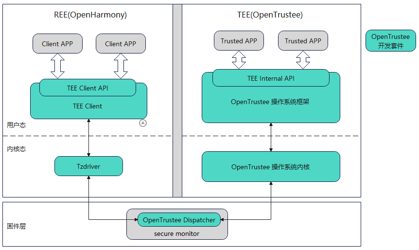

## 系统架构

OpenTrustee是一套完整的TEE解决方案，包含多个部件，系统架构如同所示：

各部件基本功能介绍如下：

**TEE Client**

- 部署在REE侧用户态，为CA提供符合GP TEE标准的TEE Client API；
- 内置TEE的代理服务：如日志代理服务，支持获取TEE侧日志并落盘到REE侧文件系统；如安全存储服务，支持获取TEE侧加密的数据并落盘到REE侧文件系统。

**Tzdriver**

- 部署在REE侧内核中的驱动，支持REE和TEE进行通信。

**OpenTrustee 操作系统框架**

- 为TA提供符合GP TEE标准的TEE Internal API；
- 提供TA运行管理、驱动运行管理等框架基础服务；
- 提供安全存储、加解密等安全能力。

**OpenTrustee 操作系统内核**

- ChCore微内核，提供IPC/进程管理/内存管理/调度/中断管理/REE和TEE切换等基础内核功能。

**OpenTrustee 开发套件**

- 包括TA开发套件和驱动开发套件两部分，提供API头文件、编译框架、签名脚本、demo样例等，支持高效开发TA和驱动。

**OpenTrustee Dispatcher**

- 部署在ATF中，在REE和TEE之间交互时完成两个世界上下文的切换。

## 贡献

[如何贡献](https://gitee.com/openharmony/docs/blob/HEAD/zh-cn/contribute/%E5%8F%82%E4%B8%8E%E8%B4%A1%E7%8C%AE.md)

### 编码规范

[OpenHarmony C&C++ 安全编程指南](https://gitee.com/openharmony/docs/blob/master/zh-cn/contribute/OpenHarmony-c-cpp-secure-coding-guide.md)

### license

遵循Mulan PSL V2协议；