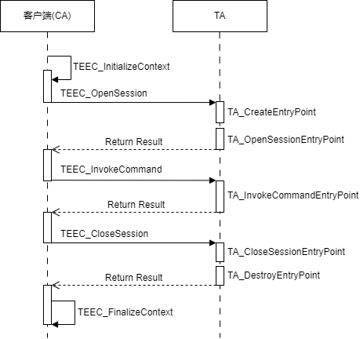

# OpenTrustee CA/TA开发指南

## CA/TA访问机制

OpenTrustee应用分为CA（客户端应用）和TA（可信应用）。OpenTrustee支持CA访问TA，也支持TA访问TA。TA采用命令响应机制，交互流程如下：




1. CA调用TEEC_InitializeContext初始化客户端上下文，这个过程并不会访问TA。
2. CA调用TEEC_OpenSession建立与TA的会话。OpenTrustee系统会把TA加载运行，创建TA实例并调用TA的TA_CreateEntryPoint。然后再创建TA会话并调用TA的TA_OpenSessionEntryPoint接口。客户端可以跟TA建立多个会话，每个会话发起时OpenTrustee都会调用TA_OpenSessionEntryPoint接口。
3. CA调用TEEC_InvokeCommand向TA发送命令，OpenTrustee系统会调用TA的TA_InvokeCommandEntryPoint接口处理该命令并返回结果。
4. CA调用TEEC_CloseSession关闭与TA的会话。OpenTrustee系统会调用TA的TA_CloseSessionEntryPoint接口清理资源。在TA最后一个会话被关闭时，OpenTrustee系统会调用TA的TA_DestroyEntryPoint接口清理全局资源。
5. CA调用TEEC_FinalizeContext，清理上下文。

OpenTrustee的实现遵循GP TEE标准的规定，上述流程可参考GP TEE标准。

## CA开发指导

CA即OpenHarmony系统侧应用，可以是native程序或SA服务，暂不支持HAP应用。

### CA接口库

对于用户态CA，OpenTrustee TEE client模块为CA提供了访问TEE的接口库和API。

对于system/bin侧的CA，引用TEE头文件和接口库的方式为，在CA的BUILD.gn文件中增加如下引用：

```
include_dirs = [
        "//base/tee/tee_client/interfaces/libteec"
]
deps = [
        "//base/tee/tee_client/frameworks/build/standard:libteec"
]
```

对于vendor/bin侧的CA，引用TEE头文件和接口库的方式为，在CA的BUILD.gn文件中增加如下引用：

```
include_dirs = [
        "//base/tee/tee_client/interfaces/libteec"
]
deps = [
        "//base/tee/tee_client/frameworks/build/standard:libteec_vendor"
]
```

### CA API

OpenTrustee提供的CA API基本是符合GP TEE标准规定的，可参考《[TEE Client API Specification v1.0 (GPD_SPE_007)](https://globalplatform.org/specs-library/?filter-committee=tee)》。少量实现与GP TEE规范有差异，差异点如下：

1. TEEC_OpenSession接口的TEEC_Context结构体成员 ta_path支持指定TA的加载路径（限制在/data目录）

   举例如下：

   ```
   TEEC_Context context;
   context.ta_path = (uint8_t *)"/data/58dbb3b9-4a0c-42d2-a84d-7c7ab17539fc.sec"
   ```

2. TEEC_OpenSession接口入参connectionMethod只支持TEEC_LOGIN_IDENTIFY

   对于TEEC_OpenSession函数中第四个入参connectionMethod，GP规范定义了六种Login Method，OpenTrustee拓展了TEEC_LOGIN_IDENTIFY的类型，且只支持该种connectionMethod。

3. 调用TEEC_OpenSession时，TEEC_Operation参数有限制

   在调用TEEC_OpenSession接口时，TEEC_Operation中params[2]和params[3]是预留给系统的，不允许CA使用，CA仅可以使用params[0]和params[1]。

- CA API的简要说明如下：

| 名称 | 描述 | 
| -------- | -------- |
| TEEC_InitializeContext (const char \*name, TEEC_Context \*context) | 初始化TEE环境。 | 
| TEEC_FinalizeContext (TEEC_Context \*context) | 关闭TEE环境。 | 
| TEEC_OpenSession (TEEC_Context \*context, TEEC_Session \*session, const TEEC_UUID \*destination, uint32_t connectionMethod, const void \*connectionData, TEEC_Operation \*operation, uint32_t \*returnOrigin) | 打开会话。 | 
| TEEC_CloseSession (TEEC_Session \*session) | 关闭会话。 | 
| TEEC_InvokeCommand (TEEC_Session \*session, uint32_t commandID, TEEC_Operation \*operation, uint32_t \*returnOrigin) | 发送命令。 | 
| TEEC_RegisterSharedMemory (TEEC_Context \*context, TEEC_SharedMemory \*sharedMem) | 注册共享内存。 | 
| TEEC_AllocateSharedMemory (TEEC_Context \*context, TEEC_SharedMemory \*sharedMem) | 申请共享内存。 | 
| TEEC_ReleaseSharedMemory (TEEC_SharedMemory \*sharedMem) | 释放共享内存。 | 
| TEEC_RequestCancellation (TEEC_Operation \*operation) | 取消正在运行的操作。 | 

## TA开发指导

### TA安装包

TA安装包不需要跟OpenTrustee镜像打包到一起，可以把TA安装包文件放到非安全侧文件系统下。在TA被访问时，由TEE Client将TA安装包发送到OpenTrustee系统中加载运行。

由于TA安装包放在非安全侧文件系统中，需要对TA安装包做签名，保证安装包的完整性。

#### TA安装包路径

TA安装包放在OpenHarmony文件系统下，路径有两种选择。

1、将TA安装包命名为uuid.sec(uuid需要替换为TA的真实uuid)，放在/vendor/bin目录或者/system/bin目录，OpenTrustee Client会在TA被访问时，自动查找该TA对应的uuid.sec，发送到OpenTrustee系统中加载运行。

2、TA安装包可以自定义文件系统路径，在CA调用TEEC_OpenSession时，通过TEEC_Context的ta_path入参指定该TA安装包的路径，OpenTrustee Client会在指定路径查找该安装包，并发送到OpenTrustee系统中加载运行。

#### TA安装包格式

TA安装包是以“.sec”为后缀名的包文件，文件格式如下：包含文件头、签名块、数据区三部分


### TA签名机制

TA签名：由于TA安装包放在非安全侧文件系统中，需要对TA安装包做签名，确保加载到OpenTrutee中的TA安装包没有被篡改。OpenTrustee提供的SDK开发套件中，包含了TA的签名工具，支持对TA安装包一键签名。需要在OpenTrustee SDK开发套件中预置TA签名的私钥。

TA验签：在TA安装包加载到OpenTrustee操作系统中时，由OpenTrustee TA管理框架对TA安装包做签名验证，验证通过之后才允许该TA加载运行。需要在OpenTrustee操作系统中预置TA验签的公钥。

为了方便社区开发者调试，社区的OpenTrustee SDK开发套件已经预置了TA签名私钥，OpenTrustee操作系统中预置了验签的公钥。开发者在OpenTrustee商用版本中应自行替换该签名私钥和验签公钥。

### SDK开发套件

#### 介绍

OpenTrustee提供了SDK开发套件支持独立开发TA，该开发套件集成了TA头文件、TA编译框架、TA签名脚本、demo样例等，目录结构如下：

```
├── build
│   ├── ld                                # 生成TA ELF文件的链接脚本
│   ├── mk                                # TA make编译框架
│   ├── signkey                           # TA签名用的私钥
│   └── tools                             # 生成TA安装包并对TA签名的脚本
├── include
│   └── TA                                # 给TA提供的TEE头文件
├── src
│   └── TA                                # 放置TA源码和示例
        └── helloworld_demo               # TA helloworld示例
        └── secstorage_demo               # 安全存储示例
├── thirdparty
│   └── open_source
│       └── import_open_source_header.sh  # 导入TA编译依赖的musl头文件和安全函数库头文件
```

- 开发语言：C语言
- 代码编辑器：未提供特定编辑器，任意支持C语言开发的编辑器均可
- SDK执行环境：linux操作系统
- SDK套件下载地址：https://gitee.com/openharmony-sig/tee_tee_dev_kit

#### 开发套件准备

开发者在使用OpenTrustee SDK开发套件开发TA之前，需要进行一些准备工作。

##### 配置编译工具链

OpenTrustee使用的编译工具链为llvm，与OpenHarmony一致，开发者需要先下载OpenHarmony编译工具链。

首选下载OpenHarmony [build代码仓](https://gitee.com/openharmony/build)，

```
git clone git@gitee.com:openharmony/build.git
```

然后执行该仓中的下载脚本

```
./build/prebuilts_download.sh
```

下载完成后，需要在当前编译环境中声明llvm编译工具链的路径。可通过如下命令声明编译工具链路径：

```
export PATH=openharmony/prebuilts/clang/ohos/linux-x86_64/15.0.4/llvm/bin:$PATH
```

该命令仅是示例，开发者需要指定正确的编译工具链路径。

##### 导入第三方头文件

OpenTrustee集成了musl库和安全函数库，TA可以使用这些库。OpenTrustee SDK并没有默认包含musl库和安全函数库的头文件，但是提供了导入的脚本。
开发者需要先下载[musl库](https://gitee.com/openharmony/third_party_musl)和[安全函数库](https://gitee.com/openharmony/third_party_bounds_checking_function)源码仓：

```
git clone git@gitee.com:openharmony/third_party_musl.git
git clone git@gitee.com:openharmony/third_party_bounds_checking_function.git
```

然后执行

```
./tee_dev_kit/sdk/thirdparty/open_source/import_open_source_header.sh
```

将musl头文件和安全函数库头文件从源码仓导入到OpenTrustee SDK中。

##### 替换TA签名和验签密钥
OpenTrustee SDK中预置了对TA文件进行签名的私钥，该预置私钥只能用来调试，在商用版本中，开发者需要自行替换该私钥。该私钥路径：tee_dev_kit/sdk/build/signkey/ta_sign_priv_key.pem。同时提供了tee_dev_kit/sdk/build/signkey/ta_sign_algo_config.ini脚本，可以用来对签名算法进行配置。默认的签名算法是RSA，密钥长度4096bit。

如果开发者替换了OpenTrustee SDK中的签名私钥，需要对应替换OpenTrustee操作系统中的验签公钥，验签公钥的路径：tee_os_framework/lib/syslib/libelf_verify_key/src/common/ta_verify_key.c。

##### 工具安装

###### 安装python工具

OpenTrustee SDK中用到了python脚本来完成TA的属性配置文件解析、对TA文件进行签名等操作，因此需要在开发环境上安装python工具。以Ubuntu系统为例，安装命令如下：

1、安装python3

```
sudo apt-get update
sudo apt-get install python3 python3-pip
```

2、安装python相关的库，如：

```
pip install pycryptodome
pip install defusedxml
```

如果在编译过程中提示缺少其他python库，需要一并安装。

###### 安装openssl工具

OpenTrustee SDK使用openssl工具的签名算法来对TA文件进行签名，需要在开发环境上安装openssl工具。

```
sudo apt-get install openssl
```

###### 安装make工具

需要在开发环境上安装make工具来对TA源码进行编译。

```
sudo apt-get install make
```

### TA开发步骤

开发一个新的TA时，需要在tee_dev_kit/sdk/src/TA目录下创建新的TA源码目录，目录结构可以参考该目录下demo示例代码。以helloworld_demo为例，目录结构如下：

```
├── helloworld_demo
    ├── ta_demo.c                  # TA源码文件
    ├── configs.xml                # TA属性配置文件
    ├── Makefile                   # TA编译Makefile
    ├── build_ta.sh                # TA一键生成脚本
```

##### TA代码编写

TA代码必须实现如下GP TEE标准规定的入口函数：

| TA入口函数名称             | 函数描述                                              |
| -------------------------- | ----------------------------------------------------- |
| TA_CreateEntryPoint        | TA实例的构造函数，每个TA实例的生命周期中只被调用一次  |
| TA_OpenSessionEntryPoint   | 客户端请求创建一个与TA的会话                          |
| TA_InvokeCommandEntryPoint | 客户端在创建会话成功后向TA发送指令                    |
| TA_CloseSessionEntryPoint  | 客户端请求关闭与TA的会话                              |
| TA_DestroyEntryPoint       | TA示例的析构函数，OpenTrustee在销毁TA实例时调用此函数 |

在客户端访问TA时，OpenTrustee系统会主动调用TA的这些入口函数。详细的参数接口定义请参考TA API章节。

##### TA Makefile编写

TA需要自行编写Makefile文件，可参考SDK中示例代码。有如下要点：

- TA编译生成的目标文件名固定为libcombine.so。
- 对于64位的TA，需要在Makefile头部增加“TARGET_IS_ARM64 = y”标记；对于32位TA，Makefile中不应包含此标记。

##### TA属性配置

每个TA源码目录下需要包含configs.xml，定义该TA的属性信息。

| 属性名              | 数据类型 | 属性描述                                                     | 系统默认值 |
| ------------------- | -------- | ------------------------------------------------------------ | ---------- |
| service_name        | String   | TA名称，字符串长度不超过64字符，仅支持数字、字母，'_'和'-'   | 无         |
| uuid                | UUID     | TA唯一标识                                                   | 无         |
| instance_keep_alive | Bool     | 如果为true，表示即使TA所有会话被关闭，TA实例也不会被销毁，全局数据仍然存在，直到TEE运行结束。如果为false，表示若TA所有会话关闭，TA实例会被销毁。 | false      |
| stack_size          | Integer  | TA每个会话的栈空间大小，需要根据TA实际情况评估               | 8192       |
| heap_size           | Integer  | TA实例占用的堆空间大小，需要根据TA实际情况评估               | 0          |
| multi_session       | Bool     | TA是否支持同时建立多个会话                                   | false      |
| single_instance     | Bool     | TA的多个会话是否归属同一个实例(当前只支持singleInstance为true) | true       |

示例如下：

```
<ConfigInfo>
  <TA_Basic_Info>
    <service_name>demo-ta</service_name>
    <uuid>e3d37f4a-f24c-48d0-8884-3bdd6c44e988</uuid>
  </TA_Basic_Info>
  <TA_Manifest_Info>
    <instance_keep_alive>false</instance_keep_alive>
    <stack_size>8192</stack_size>
    <heap_size>81920</heap_size>
    <multi_session>false</multi_session>
    <single_instance>true</single_instance>
  </TA_Manifest_Info>
</ConfigInfo>
```

##### TA编译和签名

OpenTrustee SDK中提供了TA一键生成脚本，将tee_dev_kit/sdk/build/build_ta.sh拷贝到TA源码目录执行，即完成TA编译、属性配置文件解析、签名等操作，在当前目录生成uuid.sec命名的TA安装包文件。

##### TA规格约束

由于OpenTrustee内存资源有限，因此对TA的资源占用需严格约束。

- TA安装包文件大小，应小于8M，否则会被拒绝加载
- 单个TA最大会话数量上限为8
- TA应优化自己的内存占用，避免占用过多内存，导致OpenTrustee系统内存耗尽

### TA API
TA的API接口在SDK中include/TA目录下，以下是TA API的简要描述，详细介绍可参考《[TEE Client API Specification v1.0 (GPD_SPE_007)](https://globalplatform.org/specs-library/?filter-committee=tee)。

- TA会话操作接口

| 名称 | 描述 | 
| -------- | -------- |
| TEE_Panic (TEE_Result panicCode) | 在受信任的应用程序实例中引发死机 | 
| TEE_OpenTASession (const TEE_UUID \*destination, uint32_t cancellationRequestTimeout, uint32_t paramTypes, TEE_Param paramsTEE_PARAMS_NUM, TEE_TASessionHandle \*session, uint32_t \*returnOrigin) | 使用受信任应用程序打开新会话 | 
| TEE_CloseTASession (TEE_TASessionHandle session) | 关闭由TEE_OpenTASession打开的客户端会话 | 
| TEE_InvokeTACommand (TEE_TASessionHandle session, uint32_t cancellationRequestTimeout, uint32_t commandID, uint32_t paramTypes, TEE_Param paramsTEE_PARAMS_NUM, uint32_t \*returnOrigin) | 在客户端受信任应用程序实例和目标受信任应用程序实例之间打开的会话中调用命令 |

- TA安全存储接口

| 名称 | 描述 | 
| -------- | -------- |
| TEE_GetObjectBufferAttribute (TEE_ObjectHandle object, uint32_t attributeID, void \*buffer, size_t \*size) | 在TEE_ObjectHandle指向的对象的TEE_Attribute结构中获取联合的缓冲区内容 | 
| TEE_GetObjectValueAttribute (TEE_ObjectHandle object, uint32_t attributeID, uint32_t \*a, uint32_t \*b) | 在对象中的TEE_Attribute中获取联合的值 | 
| TEE_CloseObject (TEE_ObjectHandle object) | 关闭打开的TEE_ObjectHandle对象 | 
| TEE_AllocateTransientObject (uint32_t objectType, uint32_t maxObjectSize, TEE_ObjectHandle \*object) | 分配一个未初始化的对象来存储密钥或密钥对 | 
| TEE_FreeTransientObject (TEE_ObjectHandle object) | 释放已分配的临时对象 | 
| TEE_ResetTransientObject (TEE_ObjectHandle object) | 将瞬态对象重置为初始状态，即分配后的状态 | 
| TEE_PopulateTransientObject (TEE_ObjectHandle object, TEE_Attribute \*attrs, uint32_t attrCount) | 将参数attrs中的属性分配给未初始化的瞬态对象 | 
| TEE_InitRefAttribute (TEE_Attribute \*attr, uint32_t attributeID, void \*buffer, size_t length) | 初始化缓冲区类型TEE_Attribute | 
| TEE_InitValueAttribute (TEE_Attribute \*attr, uint32_t attributeID, uint32_t a, uint32_t b) | 初始化TEE_Attribute | 
| TEE_GenerateKey (TEE_ObjectHandle object, uint32_t keySize, TEE_Attribute \*params, uint32_t paramCount) | 此函数生成随机密钥或密钥对，并将其分配给临时对象 | 
| TEE_GetObjectInfo1 (TEE_ObjectHandle object, TEE_ObjectInfo \*objectInfo) | 获取对象的TEE_ObjectInfo | 
| TEE_CopyObjectAttributes1 (TEE_ObjectHandle destObject, TEE_ObjectHandle srcObject) | 使用初始化对象将TEE_Attribute赋值给未初始化的对象 | 
| TEE_RestrictObjectUsage1 (TEE_ObjectHandle object, uint32_t objectUsage) | 限制对象的objectUse位 | 
| TEE_CreatePersistentObject (uint32_t storageID, constvoid \*ojbectID, size_t objectIDLen, uint32_t flags, TEE_ObjectHandle attributes, constvoid \*initialData, size_t initialDataLen, TEE_ObjectHandle \*object) | 创建一个新的持久化对象 | 
| TEE_OpenPersistentObject (uint32_t storageID, constvoid \*ojbectID, size_t objectIDLen, uint32_t flags, TEE_ObjectHandle \*object) | 打开现有的永久对象 | 
| TEE_ReadObjectData (TEE_ObjectHandle ojbect, void \*buffer, size_t size, uint32_t \*count) | 从对象的数据流读取数据的大小字节到缓冲区 | 
| TEE_WriteObjectData (TEE_ObjectHandle ojbect, constvoid \*buffer, size_t size) | 将数据从缓冲区写入对象的数据流的大小字节 | 
| TEE_TruncateObjectData (TEE_ObjectHandle object, size_t size) | 更改数据流的大小 | 
| TEE_SeekObjectData (TEE_ObjectHandle object, int32_t offset, TEE_Whence whence) | 设置TEE_ObjectHandle指向的数据流位置 | 
| TEE_SyncPersistentObject (TEE_ObjectHandle object) | 同步打开的TEE_ObjectHandle并同步相应的安全属性文件到磁盘 | 
| TEE_RenamePersistentObject (TEE_ObjectHandle object, void \*newObjectID, size_t newObjectIDLen) | 更改对象标识符 | 
| TEE_AllocatePersistentObjectEnumerator (TEE_ObjectEnumHandle \*obj_enumerator) | 分配未初始化对象枚举器的句柄 | 
| TEE_FreePersistentObjectEnumerator (TEE_ObjectEnumHandle obj_enumerator) | 释放已分配的对象枚举器句柄。 | 
| TEE_ResetPersistentObjectEnumerator (TEE_ObjectEnumHandle obj_enumerator) | 将临时对象枚举器重置为其初始状态，即分配后的状态 | 
| TEE_StartPersistentObjectEnumerator (TEE_ObjectEnumHandle obj_enumerator, uint32_t storage_id) | 开始枚举给定存储空间中的所有对象 | 
| TEE_GetNextPersistentObject (TEE_ObjectEnumHandle obj_enumerator, TEE_ObjectInfo \*object_info, void \*object_id, size_t \*object_id_len) | 获取对象枚举器中的下一个对象 | 
| TEE_CloseAndDeletePersistentObject1 (TEE_ObjectHandle object) | 关闭打开的TEE_ObjectHandle并删除对象 |

- TA加解密接口

| 名称 | 描述 | 
| -------- | -------- |
| TEE_AllocateOperation (TEE_OperationHandle \*operation, uint32_t algorithm, uint32_t mode, uint32_tmaxKeySize) | 申请操作句柄 | 
| TEE_FreeOperation (TEE_OperationHandle operation) | 释放操作句柄 | 
| TEE_GetOperationInfo (const TEE_OperationHandle operation, TEE_OperationInfo \*operationInfo) | 获取操作信息 | 
| TEE_ResetOperation (TEE_OperationHandle operation) | 复位操作句柄 | 
| TEE_SetOperationKey (TEE_OperationHandle operation, const TEE_ObjectHandle key) | 设置操作密钥 | 
| TEE_SetOperationKey2 (TEE_OperationHandle operation, const TEE_ObjectHandle key1, const TEE_ObjectHandle key2) | 设置操作密钥2 | 
| TEE_CopyOperation (TEE_OperationHandle dstOperation, const TEE_OperationHandle srcOperation) | 复制操作句柄 | 
| TEE_CipherInit (TEE_OperationHandle operation, constvoid \*IV, size_t IVLen) | 初始化密码上下文 | 
| TEE_CipherUpdate (TEE_OperationHandle operation, constvoid \*srcData, size_t srcLen, void \*destData, size_t \*destLen) | 执行密码更新 | 
| TEE_CipherDoFinal (TEE_OperationHandle operation, constvoid \*srcData, size_t srcLen, void \*destData, size_t \*destLen) | 执行密码完成 | 
| TEE_DigestUpdate (TEE_OperationHandle operation, constvoid \*chunk, size_t chunkSize) | 摘要更新 | 
| TEE_DigestDoFinal (TEE_OperationHandle operation, constvoid \*chunk, size_t chunkLen, void \*hash, size_t \*hashLen) | 执行摘要结束 | 
| TEE_MACInit (TEE_OperationHandle operation, void \*IV, size_t IVLen) | 执行mac初始化 | 
| TEE_MACUpdate (TEE_OperationHandle operation, const void \*chunk, size_t chunkSize) | 执行mac更新 | 
| TEE_MACComputeFinal (TEE_OperationHandle operation, const void \*message, size_t messageLen, void \*mac, size_t \*macLen) | mac计算完成 | 
| TEE_MACCompareFinal (TEE_OperationHandle operation, const void \*message, size_t messageLen, const void \*mac, constsize_t macLen) | mac比较完成 | 
| void TEE_DeriveKey (TEE_OperationHandle operation, const TEE_Attribute \*params, uint32_t paramCount, TEE_ObjectHandle derivedKey) | 派生密钥 | 
| TEE_GenerateRandom (void \*randomBuffer, size_t randomBufferLen) | 生成随机数据 | 
| TEE_AEInit (TEE_OperationHandle operation, void \*nonce, size_t nonceLen, uint32_t tagLen, size_t AADLen, size_t payloadLen) | ae初始化 | 
| TEE_AEUpdateAAD (TEE_OperationHandle operation, const void \*AADdata, size_t AADdataLen) | 更新ae aad | 
| TEE_AEUpdate (TEE_OperationHandle operation, void \*srcData, size_t srcLen, void \*destData, size_t \*destLen) | 更新ae | 
| TEE_AEEncryptFinal (TEE_OperationHandle operation, void \*srcData, size_t srcLen, void \*destData, size_t \*destLen, void \*tag, size_t \*tagLen) | ae加密 | 
| TEE_AEDecryptFinal (TEE_OperationHandle operation, void \*srcData, size_t srcLen, void \*destData, size_t \*destLen, void \*tag, size_t tagLen) | ae解密 | 
| TEE_AsymmetricEncrypt (TEE_OperationHandle operation, const TEE_Attribute \*params, uint32_t paramCount, void \*srcData, size_t srcLen, void \*destData, size_t \*destLen) | 非对称加密 | 
| TEE_AsymmetricDecrypt (TEE_OperationHandle operation, const TEE_Attribute \*params, uint32_t paramCount, void \*srcData, size_t srcLen, void \*destData, size_t \*destLen) | 非对称解密 | 
| TEE_AsymmetricSignDigest (TEE_OperationHandle operation, const TEE_Attribute \*params, uint32_t paramCount, void \*digest, size_t digestLen, void \*signature, size_t \*signatureLen) | 非对称签名 | 
| TEE_AsymmetricVerifyDigest (TEE_OperationHandle operation, const TEE_Attribute \*params, uint32_t paramCount, void \*digest, size_t digestLen, void \*signature, size_t signatureLen) | 非对称验证 | 
| TEE_GetOperationInfoMultiple (TEE_OperationHandle operation, TEE_OperationInfoMultiple \*operationInfoMultiple, constsize_t \*operationSize) | 获取操作信息 | 
| TEE_IsAlgorithmSupported (uint32_t algId, uint32_t element) | 检查算法是否被支持 | 
| TEE_SetCryptoFlag (TEE_OperationHandle operation, uint32_t crypto) | 将加密和解密引擎设置为运行 | 
| TEE_SetObjectFlag (TEE_ObjectHandle object, uint32_t crypto) | 设置加解密引擎为object |

- TA内存操作接口

| 名称 | 描述 | 
| -------- | -------- |
| TEE_MemFill (void \*buffer, uint32_t x, size_t size) | 用x填充缓冲区的第一个大小字节 | 
| TEE_MemMove (void \*dest, constvoid \*src, size_t size) | 将大小字节从src复制到dest | 
| TEE_Malloc (size_t size, uint32_t hint) | 使用提示值分配大小字节的内存返回的指针将兼容任何C基本数据类型 | 
| TEE_Free (void \*buffer) | 释放TEE_Malloc分配的内存 | 
| TEE_Realloc (void \*buffer, size_t new_size) | 重新分配内存 | 
| TEE_MemCompare (constvoid \*buffer1, constvoid \*buffer2, size_t size) | 内存内容比较 | 
| TEE_CheckMemoryAccessRights (uint32_t accessFlags, constvoid \*buffer, size_t size) | 检查缓冲区的访问权限 | 
| TEE_SetInstanceData (void \*instanceData) | 用于在同一实例的不同会话中共享的全局变量 | 
| TEE_GetInstanceData (void) | 获取TEE_SetInstanceData设置的指针 |

- TA安全时间接口

| 名称 | 描述 | 
| -------- | -------- |
| TEE_GetSystemTime (TEE_Time \*time) | 获取当前TEE系统时间 | 
| TEE_Wait (uint32_t timeout) | 等待指定的毫秒数 | 
| TEE_GetTAPersistentTime (TEE_Time \*time) | 检索受信任应用程序的持久时间 | 
| TEE_SetTAPersistentTime (TEE_Time \*time) | 设置当前受信任应用程序的持久化时间 | 
| TEE_GetREETime (TEE_Time \*time) | 获取当前REE系统时间 | 

- TA扩展接口

| 名称 | 描述 | 
| -------- | -------- |
| AddCaller_CA_exec (constchar \*ca_name, uint32_t ca_uid) | TA可以调用此API添加调用者信息，允许调用此TA。此API用于CA，以二进制可执行文件的形式 | 
| TEE_GetSessionType (void) | 获取当前会话类型 | 
| TEE_EXT_GetDeviceUniqueId (uint8_t \*device_unique_id, uint32_t \*length) | 在TEE中获取设备唯一ID | 


### TEE标准C库支持<a name="ZH-CN_TOPIC_0000001241900905"></a>

支持大多数的POSIX接口，具体支持情况请参考：POSIX: [https://mirror.math.princeton.edu/pub/oldlinux/download/c953.pdf](https://mirror.math.princeton.edu/pub/oldlinux/download/c953.pdf)

支持绝大多数的libc接口。使用musl/libc库，接口支持请参考下表。

> **说明：** 
>-   不支持文件系统、控制台。
>-   不支持fstat，fsync，writev接口。
>-   stdio中的printf函数目前不支持文件系统，文件操作只支持标准输入输出。

**表 1**  标准C支持列表

<a name="table7336617112614"></a>
<table><thead align="left"><tr id="row1633681714266"><th class="cellrowborder" valign="top" width="47.88%" id="mcps1.2.3.1.1"><p id="p1653154512717"><a name="p1653154512717"></a><a name="p1653154512717"></a>模块</p>
</th>
<th class="cellrowborder" valign="top" width="52.12%" id="mcps1.2.3.1.2"><p id="p1253114512274"><a name="p1253114512274"></a><a name="p1253114512274"></a>函数接口名</p>
</th>
</tr>
</thead>
<tbody><tr id="row6340121710262"><td class="cellrowborder" rowspan="40" valign="top" width="47.88%" headers="mcps1.2.3.1.1 "><p id="p18534845102711"><a name="p18534845102711"></a><a name="p18534845102711"></a>pthread</p>
</td>
<td class="cellrowborder" valign="top" width="52.12%" headers="mcps1.2.3.1.2 "><p id="p553444592710"><a name="p553444592710"></a><a name="p553444592710"></a>sem_getvalue</p>
</td>
</tr>
<tr id="row10341181782614"><td class="cellrowborder" valign="top" headers="mcps1.2.3.1.1 "><p id="p753424552719"><a name="p753424552719"></a><a name="p753424552719"></a>sem_init</p>
</td>
</tr>
<tr id="row534110172268"><td class="cellrowborder" valign="top" headers="mcps1.2.3.1.1 "><p id="p1853444542719"><a name="p1853444542719"></a><a name="p1853444542719"></a>sem_post</p>
</td>
</tr>
<tr id="row203411176269"><td class="cellrowborder" valign="top" headers="mcps1.2.3.1.1 "><p id="p1553474572712"><a name="p1553474572712"></a><a name="p1553474572712"></a>sem_wait</p>
</td>
</tr>
<tr id="row5341131742616"><td class="cellrowborder" valign="top" headers="mcps1.2.3.1.1 "><p id="p10534184519273"><a name="p10534184519273"></a><a name="p10534184519273"></a>pthread_mutex_destroy</p>
</td>
</tr>
<tr id="row18341101714263"><td class="cellrowborder" valign="top" headers="mcps1.2.3.1.1 "><p id="p12534184522712"><a name="p12534184522712"></a><a name="p12534184522712"></a>pthread_mutex_init</p>
</td>
</tr>
<tr id="row18341101714263"><td class="cellrowborder" valign="top" headers="mcps1.2.3.1.1 "><p id="p12534184522712"><a name="p12534184522712"></a><a name="p12534184522712"></a>pthread_mutex_lock</p>
</td>
</tr>
<tr id="row18341101714263"><td class="cellrowborder" valign="top" headers="mcps1.2.3.1.1 "><p id="p12534184522712"><a name="p12534184522712"></a><a name="p12534184522712"></a>pthread_mutex_trylock</p>
</td>
</tr>
<tr id="row18341101714263"><td class="cellrowborder" valign="top" headers="mcps1.2.3.1.1 "><p id="p12534184522712"><a name="p12534184522712"></a><a name="p12534184522712"></a>pthread_mutex_unlock</p>
</td>
</tr>
<tr id="row18341101714263"><td class="cellrowborder" valign="top" headers="mcps1.2.3.1.1 "><p id="p12534184522712"><a name="p12534184522712"></a><a name="p12534184522712"></a>pthread_mutexattr_destroy</p>
</td>
</tr>
<tr id="row18341101714263"><td class="cellrowborder" valign="top" headers="mcps1.2.3.1.1 "><p id="p12534184522712"><a name="p12534184522712"></a><a name="p12534184522712"></a>pthread_mutexattr_init</p>
</td>
</tr>
<tr id="row18341101714263"><td class="cellrowborder" valign="top" headers="mcps1.2.3.1.1 "><p id="p12534184522712"><a name="p12534184522712"></a><a name="p12534184522712"></a>pthread_mutexattr_setprotocol</p>
</td>
</tr>
<tr id="row18341101714263"><td class="cellrowborder" valign="top" headers="mcps1.2.3.1.1 "><p id="p12534184522712"><a name="p12534184522712"></a><a name="p12534184522712"></a>pthread_mutexattr_settype</p>
</td>
</tr>
<tr id="row18341101714263"><td class="cellrowborder" valign="top" headers="mcps1.2.3.1.1 "><p id="p12534184522712"><a name="p12534184522712"></a><a name="p12534184522712"></a>pthread_spin_destroy</p>
</td>
</tr>
<tr id="row18341101714263"><td class="cellrowborder" valign="top" headers="mcps1.2.3.1.1 "><p id="p12534184522712"><a name="p12534184522712"></a><a name="p12534184522712"></a>pthread_spin_init</p>
</td>
</tr>
<tr id="row18341101714263"><td class="cellrowborder" valign="top" headers="mcps1.2.3.1.1 "><p id="p12534184522712"><a name="p12534184522712"></a><a name="p12534184522712"></a>pthread_spin_lock/p>
</td>
</tr>
<tr id="row18341101714263"><td class="cellrowborder" valign="top" headers="mcps1.2.3.1.1 "><p id="p12534184522712"><a name="p12534184522712"></a><a name="p12534184522712"></a>pthread_spin_trylock</p>
</td>
</tr>
<tr id="row18341101714263"><td class="cellrowborder" valign="top" headers="mcps1.2.3.1.1 "><p id="p12534184522712"><a name="p12534184522712"></a><a name="p12534184522712"></a>pthread_spin_unlock</p>
</td>
</tr>
<tr id="row18341101714263"><td class="cellrowborder" valign="top" headers="mcps1.2.3.1.1 "><p id="p12534184522712"><a name="p12534184522712"></a><a name="p12534184522712"></a>pthread_cond_broadcast</p>
</td>
</tr>
<tr id="row18341101714263"><td class="cellrowborder" valign="top" headers="mcps1.2.3.1.1 "><p id="p12534184522712"><a name="p12534184522712"></a><a name="p12534184522712"></a>pthread_cond_destroy</p>
</td>
</tr>
<tr id="row18341101714263"><td class="cellrowborder" valign="top" headers="mcps1.2.3.1.1 "><p id="p12534184522712"><a name="p12534184522712"></a><a name="p12534184522712"></a>pthread_cond_init</p>
</td>
</tr>
<tr id="row18341101714263"><td class="cellrowborder" valign="top" headers="mcps1.2.3.1.1 "><p id="p12534184522712"><a name="p12534184522712"></a><a name="p12534184522712"></a>pthread_cond_signal</p>
</td>
</tr>
<tr id="row18341101714263"><td class="cellrowborder" valign="top" headers="mcps1.2.3.1.1 "><p id="p12534184522712"><a name="p12534184522712"></a><a name="p12534184522712"></a>pthread_cond_wait</p>
</td>
</tr>
<tr id="row18341101714263"><td class="cellrowborder" valign="top" headers="mcps1.2.3.1.1 "><p id="p12534184522712"><a name="p12534184522712"></a><a name="p12534184522712"></a>pthread_attr_destroy</p>
</td>
</tr>
<tr id="row18341101714263"><td class="cellrowborder" valign="top" headers="mcps1.2.3.1.1 "><p id="p12534184522712"><a name="p12534184522712"></a><a name="p12534184522712"></a>pthread_attr_getstack</p>
</td>
</tr>
<tr id="row18341101714263"><td class="cellrowborder" valign="top" headers="mcps1.2.3.1.1 "><p id="p12534184522712"><a name="p12534184522712"></a><a name="p12534184522712"></a>pthread_attr_getstacksize</p>
</td>
</tr>
<tr id="row18341101714263"><td class="cellrowborder" valign="top" headers="mcps1.2.3.1.1 "><p id="p12534184522712"><a name="p12534184522712"></a><a name="p12534184522712"></a>pthread_attr_init</p>
</td>
</tr>
<tr id="row18341101714263"><td class="cellrowborder" valign="top" headers="mcps1.2.3.1.1 "><p id="p12534184522712"><a name="p12534184522712"></a><a name="p12534184522712"></a>pthread_attr_setstack</p>
</td>
</tr>
<tr id="row18341101714263"><td class="cellrowborder" valign="top" headers="mcps1.2.3.1.1 "><p id="p12534184522712"><a name="p12534184522712"></a><a name="p12534184522712"></a>pthread_attr_setstacksize</p>
</td>
</tr>
<tr id="row18341101714263"><td class="cellrowborder" valign="top" headers="mcps1.2.3.1.1 "><p id="p12534184522712"><a name="p12534184522712"></a><a name="p12534184522712"></a>pthread_create</p>
</td>
</tr>
<tr id="row18341101714263"><td class="cellrowborder" valign="top" headers="mcps1.2.3.1.1 "><p id="p12534184522712"><a name="p12534184522712"></a><a name="p12534184522712"></a>pthread_equal</p>
</td>
</tr>
<tr id="row18341101714263"><td class="cellrowborder" valign="top" headers="mcps1.2.3.1.1 "><p id="p12534184522712"><a name="p12534184522712"></a><a name="p12534184522712"></a>pthread_exit</p>
</td>
</tr>
<tr id="row18341101714263"><td class="cellrowborder" valign="top" headers="mcps1.2.3.1.1 "><p id="p12534184522712"><a name="p12534184522712"></a><a name="p12534184522712"></a>pthread_getspecific</p>
</td>
</tr>
<tr id="row18341101714263"><td class="cellrowborder" valign="top" headers="mcps1.2.3.1.1 "><p id="p12534184522712"><a name="p12534184522712"></a><a name="p12534184522712"></a>pthread_join</p>
</td>
</tr>
<tr id="row18341101714263"><td class="cellrowborder" valign="top" headers="mcps1.2.3.1.1 "><p id="p12534184522712"><a name="p12534184522712"></a><a name="p12534184522712"></a>pthread_key_create</p>
</td>
</tr>
<tr id="row18341101714263"><td class="cellrowborder" valign="top" headers="mcps1.2.3.1.1 "><p id="p12534184522712"><a name="p12534184522712"></a><a name="p12534184522712"></a>pthread_key_delete</p>
</td>
</tr>
<tr id="row18341101714263"><td class="cellrowborder" valign="top" headers="mcps1.2.3.1.1 "><p id="p12534184522712"><a name="p12534184522712"></a><a name="p12534184522712"></a>pthread_once</p>
</td>
</tr>
<tr id="row18341101714263"><td class="cellrowborder" valign="top" headers="mcps1.2.3.1.1 "><p id="p12534184522712"><a name="p12534184522712"></a><a name="p12534184522712"></a>pthread_self</p>
</td>
</tr>
<tr id="row18341101714263"><td class="cellrowborder" valign="top" headers="mcps1.2.3.1.1 "><p id="p12534184522712"><a name="p12534184522712"></a><a name="p12534184522712"></a>pthread_setschedprio</p>
</td>
</tr>
<tr id="row18341101714263"><td class="cellrowborder" valign="top" headers="mcps1.2.3.1.1 "><p id="p12534184522712"><a name="p12534184522712"></a><a name="p12534184522712"></a>pthread_setspecific</p>
</td>
</tr>
<tr id="row6340121710262"><td class="cellrowborder" rowspan="6" valign="top" width="47.88%" headers="mcps1.2.3.1.1 "><p id="p18534845102711"><a name="p18534845102711"></a><a name="p18534845102711"></a>malloc</p>
</td>
<td class="cellrowborder" valign="top" width="52.12%" headers="mcps1.2.3.1.2 "><p id="p553444592710"><a name="p553444592710"></a><a name="p553444592710"></a>aligned_alloc</p>
</td>
</tr>
<tr id="row10341181782614"><td class="cellrowborder" valign="top" headers="mcps1.2.3.1.1 "><p id="p753424552719"><a name="p753424552719"></a><a name="p753424552719"></a>calloc</p>
</td>
</tr>
<tr id="row534110172268"><td class="cellrowborder" valign="top" headers="mcps1.2.3.1.1 "><p id="p1853444542719"><a name="p1853444542719"></a><a name="p1853444542719"></a>malloc</p>
</td>
</tr>
<tr id="row203411176269"><td class="cellrowborder" valign="top" headers="mcps1.2.3.1.1 "><p id="p1553474572712"><a name="p1553474572712"></a><a name="p1553474572712"></a>realloc</p>
</td>
</tr>
<tr id="row5341131742616"><td class="cellrowborder" valign="top" headers="mcps1.2.3.1.1 "><p id="p10534184519273"><a name="p10534184519273"></a><a name="p10534184519273"></a>free</p>
</td>
</tr>
<tr id="row18341101714263"><td class="cellrowborder" valign="top" headers="mcps1.2.3.1.1 "><p id="p12534184522712"><a name="p12534184522712"></a><a name="p12534184522712"></a>posix_memalign</p>
</td>
</tr>
<tr id="row18341121732619"><td class="cellrowborder" rowspan="2" valign="top" width="47.88%" headers="mcps1.2.3.1.1 "><p id="p125341945182720"><a name="p125341945182720"></a><a name="p125341945182720"></a>mman</p>
</td>
<td class="cellrowborder" valign="top" width="52.12%" headers="mcps1.2.3.1.2 "><p id="p7534184532717"><a name="p7534184532717"></a><a name="p7534184532717"></a>mmap</p>
</td>
</tr>
<tr id="row534131772614"><td class="cellrowborder" valign="top" headers="mcps1.2.3.1.1 "><p id="p12534184513273"><a name="p12534184513273"></a><a name="p12534184513273"></a>munmap</p>
</td>
</tr>
<tr id="row434101742618"><td class="cellrowborder" rowspan="3" valign="top" width="47.88%" headers="mcps1.2.3.1.1 "><p id="p253419457279"><a name="p253419457279"></a><a name="p253419457279"></a>time</p>
</td>
<td class="cellrowborder" valign="top" width="52.12%" headers="mcps1.2.3.1.2 "><p id="p16534124510274"><a name="p16534124510274"></a><a name="p16534124510274"></a>gettimeofday</p>
</td>
</tr>
<tr id="row53411917172619"><td class="cellrowborder" valign="top" headers="mcps1.2.3.1.1 "><p id="p11534124522712"><a name="p11534124522712"></a><a name="p11534124522712"></a>strftime</p>
</td>
</tr>
<tr id="row5341101712617"><td class="cellrowborder" valign="top" headers="mcps1.2.3.1.1 "><p id="p19535845152713"><a name="p19535845152713"></a><a name="p19535845152713"></a>time</p>
</td>
</tr>
<tr id="row1334131792612"><td class="cellrowborder" rowspan="6" valign="top" width="47.88%" headers="mcps1.2.3.1.1 "><p id="p105357458277"><a name="p105357458277"></a><a name="p105357458277"></a>stdio</p>
</td>
<td class="cellrowborder" valign="top" width="52.12%" headers="mcps1.2.3.1.2 "><p id="p75354454278"><a name="p75354454278"></a><a name="p75354454278"></a>printf</p>
</td>
</tr>
<tr id="row63421517192616"><td class="cellrowborder" valign="top" headers="mcps1.2.3.1.1 "><p id="p2535154592716"><a name="p2535154592716"></a><a name="p2535154592716"></a>scanf</p>
</td>
</tr>
<tr id="row83421817132613"><td class="cellrowborder" valign="top" headers="mcps1.2.3.1.1 "><p id="p105351045132712"><a name="p105351045132712"></a><a name="p105351045132712"></a>snprintf</p>
</td>
</tr>
<tr id="row434291782619"><td class="cellrowborder" valign="top" headers="mcps1.2.3.1.1 "><p id="p12535545132715"><a name="p12535545132715"></a><a name="p12535545132715"></a>sprintf</p>
</td>
</tr>
<tr id="row19342517122616"><td class="cellrowborder" valign="top" headers="mcps1.2.3.1.1 "><p id="p3535245132711"><a name="p3535245132711"></a><a name="p3535245132711"></a>vsnprintf</p>
</td>
</tr>
<tr id="row1342161792613"><td class="cellrowborder" valign="top" headers="mcps1.2.3.1.1 "><p id="p353518454270"><a name="p353518454270"></a><a name="p353518454270"></a>vsprintf</p>
</td>
</tr>
<tr id="row734291715264"><td class="cellrowborder" rowspan="2" valign="top" width="47.88%" headers="mcps1.2.3.1.1 "><p id="p13535045172712"><a name="p13535045172712"></a><a name="p13535045172712"></a>errno</p>
</td>
<td class="cellrowborder" valign="top" width="52.12%" headers="mcps1.2.3.1.2 "><p id="p25351645132719"><a name="p25351645132719"></a><a name="p25351645132719"></a>errno</p>
</td>
</tr>
<tr id="row11342181711269"><td class="cellrowborder" valign="top" headers="mcps1.2.3.1.1 "><p id="p11535164515276"><a name="p11535164515276"></a><a name="p11535164515276"></a>strerror</p>
</td>
</tr>
<tr id="row5342151710264"><td class="cellrowborder" valign="top" width="47.88%" headers="mcps1.2.3.1.1 "><p id="p10535945152714"><a name="p10535945152714"></a><a name="p10535945152714"></a>exit</p>
</td>
<td class="cellrowborder" valign="top" width="52.12%" headers="mcps1.2.3.1.2 "><p id="p8535124519274"><a name="p8535124519274"></a><a name="p8535124519274"></a>abort</p>
</td>
</tr>
<tr id="row11342117182611"><td class="cellrowborder" rowspan="2" valign="top" width="47.88%" headers="mcps1.2.3.1.1 "><p id="p85358458277"><a name="p85358458277"></a><a name="p85358458277"></a>unistd</p>
</td>
<td class="cellrowborder" valign="top" width="52.12%" headers="mcps1.2.3.1.2 "><p id="p1753517452273"><a name="p1753517452273"></a><a name="p1753517452273"></a>getpid</p>
</td>
</tr>
<td class="cellrowborder" valign="top" width="52.12%" headers="mcps1.2.3.1.2 "><p id="p1753517452273"><a name="p1753517452273"></a><a name="p1753517452273"></a>gettid</p>
</td>
</tr>
<tr id="row1034281772615"><td class="cellrowborder" rowspan="4" valign="top" width="47.88%" headers="mcps1.2.3.1.1 "><p id="p1553514592714"><a name="p1553514592714"></a><a name="p1553514592714"></a>locale</p>
</td>
<td class="cellrowborder" valign="top" width="52.12%" headers="mcps1.2.3.1.2 "><p id="p753574512278"><a name="p753574512278"></a><a name="p753574512278"></a>setlocale</p>
</td>
</tr>
<tr id="row334220171263"><td class="cellrowborder" valign="top" headers="mcps1.2.3.1.1 "><p id="p115353451276"><a name="p115353451276"></a><a name="p115353451276"></a>strcoll</p>
</td>
</tr>
<tr id="row13343151762618"><td class="cellrowborder" valign="top" headers="mcps1.2.3.1.1 "><p id="p95351145142716"><a name="p95351145142716"></a><a name="p95351145142716"></a>strxfrm</p>
</td>
</tr>
<tr id="row173433172262"><td class="cellrowborder" valign="top" headers="mcps1.2.3.1.1 "><p id="p0535104512273"><a name="p0535104512273"></a><a name="p0535104512273"></a>strtod</p>
</td>
</tr>
<tr id="row2343131732614"><td class="cellrowborder" rowspan="3" valign="top" width="47.88%" headers="mcps1.2.3.1.1 "><p id="p95351945132716"><a name="p95351945132716"></a><a name="p95351945132716"></a>multibyte</p>
</td>
<td class="cellrowborder" valign="top" width="52.12%" headers="mcps1.2.3.1.2 "><p id="p25351345122715"><a name="p25351345122715"></a><a name="p25351345122715"></a>mbrtowc</p>
</td>
</tr>
<tr id="row1234321772614"><td class="cellrowborder" valign="top" headers="mcps1.2.3.1.1 "><p id="p185354453273"><a name="p185354453273"></a><a name="p185354453273"></a>wcrtomb</p>
</td>
</tr>
<tr id="row7343151762613"><td class="cellrowborder" valign="top" headers="mcps1.2.3.1.1 "><p id="p115361445112716"><a name="p115361445112716"></a><a name="p115361445112716"></a>wctob</p>
</td>
</tr>
<tr id="row1034351714262"><td class="cellrowborder" rowspan="4" valign="top" width="47.88%" headers="mcps1.2.3.1.1 "><p id="p135361645112710"><a name="p135361645112710"></a><a name="p135361645112710"></a>prng</p>
</td>
<td class="cellrowborder" valign="top" width="52.12%" headers="mcps1.2.3.1.2 "><p id="p19536134517272"><a name="p19536134517272"></a><a name="p19536134517272"></a>srandom</p>
</td>
</tr>
<tr id="row73431717102610"><td class="cellrowborder" valign="top" headers="mcps1.2.3.1.1 "><p id="p17536134518272"><a name="p17536134518272"></a><a name="p17536134518272"></a>initstate</p>
</td>
</tr>
<tr id="row17343181742615"><td class="cellrowborder" valign="top" headers="mcps1.2.3.1.1 "><p id="p2536144515271"><a name="p2536144515271"></a><a name="p2536144515271"></a>setstate</p>
</td>
</tr>
<tr id="row16343121711263"><td class="cellrowborder" valign="top" headers="mcps1.2.3.1.1 "><p id="p185362459278"><a name="p185362459278"></a><a name="p185362459278"></a>random</p>
</td>
</tr>
<tr id="row63431217102612"><td class="cellrowborder" rowspan="17" valign="top" width="47.88%" headers="mcps1.2.3.1.1 "><p id="p1153618451278"><a name="p1153618451278"></a><a name="p1153618451278"></a>string</p>
</td>
<td class="cellrowborder" valign="top" width="52.12%" headers="mcps1.2.3.1.2 "><p id="p1553620456277"><a name="p1553620456277"></a><a name="p1553620456277"></a>memchr</p>
</td>
</tr>
<tr id="row93431217112613"><td class="cellrowborder" valign="top" headers="mcps1.2.3.1.1 "><p id="p14536154510275"><a name="p14536154510275"></a><a name="p14536154510275"></a>memcmp</p>
</td>
</tr>
<tr id="row17344417112619"><td class="cellrowborder" valign="top" headers="mcps1.2.3.1.1 "><p id="p153684515275"><a name="p153684515275"></a><a name="p153684515275"></a>memcpy</p>
</td>
</tr>
<tr id="row1934421712265"><td class="cellrowborder" valign="top" headers="mcps1.2.3.1.1 "><p id="p1653694592712"><a name="p1653694592712"></a><a name="p1653694592712"></a>memmove</p>
</td>
</tr>
<tr id="row934411712267"><td class="cellrowborder" valign="top" headers="mcps1.2.3.1.1 "><p id="p2536114510274"><a name="p2536114510274"></a><a name="p2536114510274"></a>memset</p>
</td>
</tr>
<tr id="row163441117142619"><td class="cellrowborder" valign="top" headers="mcps1.2.3.1.1 "><p id="p105361345112715"><a name="p105361345112715"></a><a name="p105361345112715"></a>strchr</p>
</td>
</tr>
<tr id="row1434451715262"><td class="cellrowborder" valign="top" headers="mcps1.2.3.1.1 "><p id="p175366451279"><a name="p175366451279"></a><a name="p175366451279"></a>strcmp</p>
</td>
</tr>
<tr id="row534471762616"><td class="cellrowborder" valign="top" headers="mcps1.2.3.1.1 "><p id="p353694514273"><a name="p353694514273"></a><a name="p353694514273"></a>strcpy</p>
</td>
</tr>
<tr id="row334461752611"><td class="cellrowborder" valign="top" headers="mcps1.2.3.1.1 "><p id="p1753694515274"><a name="p1753694515274"></a><a name="p1753694515274"></a>strlen</p>
</td>
</tr>
<tr id="row834419172265"><td class="cellrowborder" valign="top" headers="mcps1.2.3.1.1 "><p id="p0536745102720"><a name="p0536745102720"></a><a name="p0536745102720"></a>strncmp</p>
</td>
</tr>
<tr id="row1734415175268"><td class="cellrowborder" valign="top" headers="mcps1.2.3.1.1 "><p id="p55361345192717"><a name="p55361345192717"></a><a name="p55361345192717"></a>strncpy</p>
</td>
</tr>
<tr id="row183445174264"><td class="cellrowborder" valign="top" headers="mcps1.2.3.1.1 "><p id="p115365457273"><a name="p115365457273"></a><a name="p115365457273"></a>strnlen</p>
</td>
</tr>
<tr id="row1534401712611"><td class="cellrowborder" valign="top" headers="mcps1.2.3.1.1 "><p id="p19537245112712"><a name="p19537245112712"></a><a name="p19537245112712"></a>strrchr</p>
</td>
</tr>
<tr id="row13451617142620"><td class="cellrowborder" valign="top" headers="mcps1.2.3.1.1 "><p id="p125371456272"><a name="p125371456272"></a><a name="p125371456272"></a>strstr</p>
</td>
</tr>
<tr id="row15345181762614"><td class="cellrowborder" valign="top" headers="mcps1.2.3.1.1 "><p id="p95371845142718"><a name="p95371845142718"></a><a name="p95371845142718"></a>wcschr</p>
</td>
</tr>
<tr id="row10345151718267"><td class="cellrowborder" valign="top" headers="mcps1.2.3.1.1 "><p id="p0537124512279"><a name="p0537124512279"></a><a name="p0537124512279"></a>wcslen</p>
</td>
</tr>
<tr id="row2345111710263"><td class="cellrowborder" valign="top" headers="mcps1.2.3.1.1 "><p id="p145371645142718"><a name="p145371645142718"></a><a name="p145371645142718"></a>wmemchr</p>
</td>
</tr>
<tr id="row12345131715263"><td class="cellrowborder" rowspan="13" valign="top" width="47.88%" headers="mcps1.2.3.1.1 "><p id="p753714502717"><a name="p753714502717"></a><a name="p753714502717"></a>ctype</p>
</td>
<td class="cellrowborder" valign="top" width="52.12%" headers="mcps1.2.3.1.2 "><p id="p5537145142720"><a name="p5537145142720"></a><a name="p5537145142720"></a>isalpha</p>
</td>
</tr>
<tr id="row1434581792614"><td class="cellrowborder" valign="top" headers="mcps1.2.3.1.1 "><p id="p0537184511274"><a name="p0537184511274"></a><a name="p0537184511274"></a>isascii</p>
</td>
</tr>
<tr id="row5345417182620"><td class="cellrowborder" valign="top" headers="mcps1.2.3.1.1 "><p id="p8537114513278"><a name="p8537114513278"></a><a name="p8537114513278"></a>isdigit</p>
</td>
</tr>
<tr id="row8345117122618"><td class="cellrowborder" valign="top" headers="mcps1.2.3.1.1 "><p id="p8537204582712"><a name="p8537204582712"></a><a name="p8537204582712"></a>islower</p>
</td>
</tr>
<tr id="row034551782617"><td class="cellrowborder" valign="top" headers="mcps1.2.3.1.1 "><p id="p253716455273"><a name="p253716455273"></a><a name="p253716455273"></a>isprint</p>
</td>
</tr>
<tr id="row4345101713267"><td class="cellrowborder" valign="top" headers="mcps1.2.3.1.1 "><p id="p1053713455279"><a name="p1053713455279"></a><a name="p1053713455279"></a>isspace</p>
</td>
</tr>
<tr id="row16345201752616"><td class="cellrowborder" valign="top" headers="mcps1.2.3.1.1 "><p id="p853764562716"><a name="p853764562716"></a><a name="p853764562716"></a>iswctype</p>
</td>
</tr>
<tr id="row33455179264"><td class="cellrowborder" valign="top" headers="mcps1.2.3.1.1 "><p id="p18537114522715"><a name="p18537114522715"></a><a name="p18537114522715"></a>iswdigit</p>
</td>
</tr>
<tr id="row83461317192614"><td class="cellrowborder" valign="top" headers="mcps1.2.3.1.1 "><p id="p16537154512710"><a name="p16537154512710"></a><a name="p16537154512710"></a>iswlower</p>
</td>
</tr>
<tr id="row93461117152620"><td class="cellrowborder" valign="top" headers="mcps1.2.3.1.1 "><p id="p353713458276"><a name="p353713458276"></a><a name="p353713458276"></a>iswspace</p>
</td>
</tr>
<tr id="row19346161711268"><td class="cellrowborder" valign="top" headers="mcps1.2.3.1.1 "><p id="p75371145202717"><a name="p75371145202717"></a><a name="p75371145202717"></a>iswupper</p>
</td>
</tr>
<tr id="row123461517162613"><td class="cellrowborder" valign="top" headers="mcps1.2.3.1.1 "><p id="p3537245152710"><a name="p3537245152710"></a><a name="p3537245152710"></a>towupper</p>
</td>
</tr>
<tr id="row1734671714268"><td class="cellrowborder" valign="top" headers="mcps1.2.3.1.1 "><p id="p175381245172715"><a name="p175381245172715"></a><a name="p175381245172715"></a>towlower</p>
</td>
</tr>
<tr id="row6346117112615"><td class="cellrowborder" rowspan="16" valign="top" width="47.88%" headers="mcps1.2.3.1.1 "><p id="p2538174512714"><a name="p2538174512714"></a><a name="p2538174512714"></a>math</p>
</td>
<td class="cellrowborder" valign="top" width="52.12%" headers="mcps1.2.3.1.2 "><p id="p19538184572712"><a name="p19538184572712"></a><a name="p19538184572712"></a>atan</p>
</td>
</tr>
<tr id="row8346131782613"><td class="cellrowborder" valign="top" headers="mcps1.2.3.1.1 "><p id="p15381945172717"><a name="p15381945172717"></a><a name="p15381945172717"></a>ceil</p>
</td>
</tr>
<tr id="row734617176261"><td class="cellrowborder" valign="top" headers="mcps1.2.3.1.1 "><p id="p953844582716"><a name="p953844582716"></a><a name="p953844582716"></a>ceilf</p>
</td>
</tr>
<tr id="row134610174264"><td class="cellrowborder" valign="top" headers="mcps1.2.3.1.1 "><p id="p053824511271"><a name="p053824511271"></a><a name="p053824511271"></a>copysignl</p>
</td>
</tr>
<tr id="row13346917152610"><td class="cellrowborder" valign="top" headers="mcps1.2.3.1.1 "><p id="p13538104522717"><a name="p13538104522717"></a><a name="p13538104522717"></a>exp</p>
</td>
</tr>
<tr id="row334661712269"><td class="cellrowborder" valign="top" headers="mcps1.2.3.1.1 "><p id="p5538154512710"><a name="p5538154512710"></a><a name="p5538154512710"></a>fabs</p>
</td>
</tr>
<tr id="row2347181722616"><td class="cellrowborder" valign="top" headers="mcps1.2.3.1.1 "><p id="p2538184522716"><a name="p2538184522716"></a><a name="p2538184522716"></a>floor</p>
</td>
</tr>
<tr id="row123471517122616"><td class="cellrowborder" valign="top" headers="mcps1.2.3.1.1 "><p id="p1453874562717"><a name="p1453874562717"></a><a name="p1453874562717"></a>frexp</p>
</td>
</tr>
<tr id="row153471917112616"><td class="cellrowborder" valign="top" headers="mcps1.2.3.1.1 "><p id="p14538134512271"><a name="p14538134512271"></a><a name="p14538134512271"></a>frexpl</p>
</td>
</tr>
<tr id="row234771717261"><td class="cellrowborder" valign="top" headers="mcps1.2.3.1.1 "><p id="p10538245102714"><a name="p10538245102714"></a><a name="p10538245102714"></a>log</p>
</td>
</tr>
<tr id="row1334711179265"><td class="cellrowborder" valign="top" headers="mcps1.2.3.1.1 "><p id="p185381245142719"><a name="p185381245142719"></a><a name="p185381245142719"></a>log2</p>
</td>
</tr>
<tr id="row103471317132612"><td class="cellrowborder" valign="top" headers="mcps1.2.3.1.1 "><p id="p20538144512275"><a name="p20538144512275"></a><a name="p20538144512275"></a>pow</p>
</td>
</tr>
<tr id="row133472178262"><td class="cellrowborder" valign="top" headers="mcps1.2.3.1.1 "><p id="p35389459277"><a name="p35389459277"></a><a name="p35389459277"></a>roundf</p>
</td>
</tr>
<tr id="row234731713261"><td class="cellrowborder" valign="top" headers="mcps1.2.3.1.1 "><p id="p4538154522715"><a name="p4538154522715"></a><a name="p4538154522715"></a>scalbn</p>
</td>
</tr>
<tr id="row1347917182619"><td class="cellrowborder" valign="top" headers="mcps1.2.3.1.1 "><p id="p85381845192718"><a name="p85381845192718"></a><a name="p85381845192718"></a>scalbnl</p>
</td>
</tr>
<tr id="row1134717178267"><td class="cellrowborder" valign="top" headers="mcps1.2.3.1.1 "><p id="p11538845102718"><a name="p11538845102718"></a><a name="p11538845102718"></a>sqrt</p>
</td>
</tr>
<tr id="row13348101715261"><td class="cellrowborder" rowspan="14" align="left" valign="top" width="47.88%" headers="mcps1.2.3.1.1 "><p id="p195391445102713"><a name="p195391445102713"></a><a name="p195391445102713"></a>stdlib</p>
</td>
<td class="cellrowborder" valign="top" width="52.12%" headers="mcps1.2.3.1.2 "><p id="p1153954552713"><a name="p1153954552713"></a><a name="p1153954552713"></a>abs</p>
</td>
</tr>
<tr id="row4348101732615"><td class="cellrowborder" valign="top" headers="mcps1.2.3.1.1 "><p id="p1853910450272"><a name="p1853910450272"></a><a name="p1853910450272"></a>atof</p>
</td>
</tr>
<tr id="row12348111782617"><td class="cellrowborder" valign="top" headers="mcps1.2.3.1.1 "><p id="p12539124562717"><a name="p12539124562717"></a><a name="p12539124562717"></a>atoi</p>
</td>
</tr>
<tr id="row123482178261"><td class="cellrowborder" valign="top" headers="mcps1.2.3.1.1 "><p id="p95391945102713"><a name="p95391945102713"></a><a name="p95391945102713"></a>atol</p>
</td>
</tr>
<tr id="row163481117142610"><td class="cellrowborder" valign="top" headers="mcps1.2.3.1.1 "><p id="p35391745172718"><a name="p35391745172718"></a><a name="p35391745172718"></a>atoll</p>
</td>
</tr>
<tr id="row6348217132613"><td class="cellrowborder" valign="top" headers="mcps1.2.3.1.1 "><p id="p4539164511276"><a name="p4539164511276"></a><a name="p4539164511276"></a>bsearch</p>
</td>
</tr>
<tr id="row12348191714269"><td class="cellrowborder" valign="top" headers="mcps1.2.3.1.1 "><p id="p195391245102717"><a name="p195391245102717"></a><a name="p195391245102717"></a>div</p>
</td>
</tr>
<tr id="row1634810170260"><td class="cellrowborder" valign="top" headers="mcps1.2.3.1.1 "><p id="p10539124513274"><a name="p10539124513274"></a><a name="p10539124513274"></a>ecvt</p>
</td>
</tr>
<tr id="row103481517182617"><td class="cellrowborder" valign="top" headers="mcps1.2.3.1.1 "><p id="p75392457277"><a name="p75392457277"></a><a name="p75392457277"></a>imaxabs</p>
</td>
</tr>
<tr id="row1834817175260"><td class="cellrowborder" valign="top" headers="mcps1.2.3.1.1 "><p id="p854014552719"><a name="p854014552719"></a><a name="p854014552719"></a>llabs</p>
</td>
</tr>
<tr id="row1349121792612"><td class="cellrowborder" valign="top" headers="mcps1.2.3.1.1 "><p id="p1154054562718"><a name="p1154054562718"></a><a name="p1154054562718"></a>qsort</p>
</td>
</tr>
<tr id="row15349117192614"><td class="cellrowborder" valign="top" headers="mcps1.2.3.1.1 "><p id="p14540645172719"><a name="p14540645172719"></a><a name="p14540645172719"></a>strtoul</p>
</td>
</tr>
<tr id="row134910176267"><td class="cellrowborder" valign="top" headers="mcps1.2.3.1.1 "><p id="p135401445172712"><a name="p135401445172712"></a><a name="p135401445172712"></a>strtol</p>
</td>
</tr>
<tr id="row183494173268"><td class="cellrowborder" valign="top" headers="mcps1.2.3.1.1 "><p id="p3540114519272"><a name="p3540114519272"></a><a name="p3540114519272"></a>wcstod</p>
</td>
</tr>
</tbody>
</table>

### TEE支持的安全函数<a name="ZH-CN_TOPIC_0000001241780915"></a>

#### 安全函数库介绍<a name="section11575152912113"></a>

遵循C11 Annex K \(Bounds-checking interfaces\)的标准，选取并实现了常见的内存/字符串操作类的函数，如memcpy\_s、strcpy\_s等函数。

#### 函数清单<a name="section986312451913"></a>

-   memcpy\_s
-   memmove\_s
-   memset\_s
-   strcpy\_s
-   strncpy\_s
-   strcat\_s
-   strncat\_s
-   strtok\_s
-   snprintf\_s
-   vsnprintf\_s